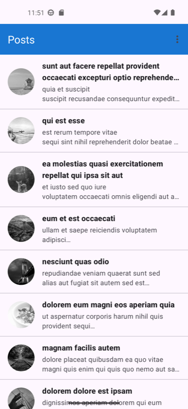
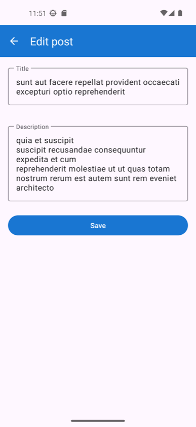
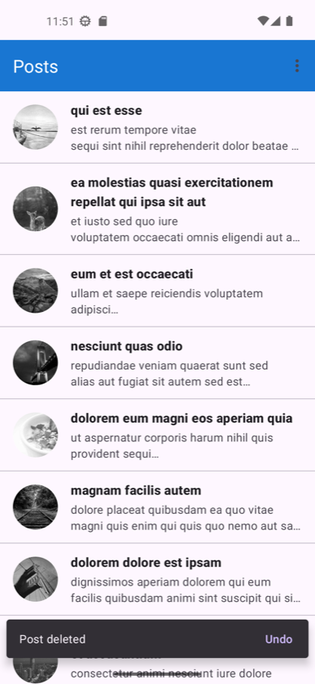
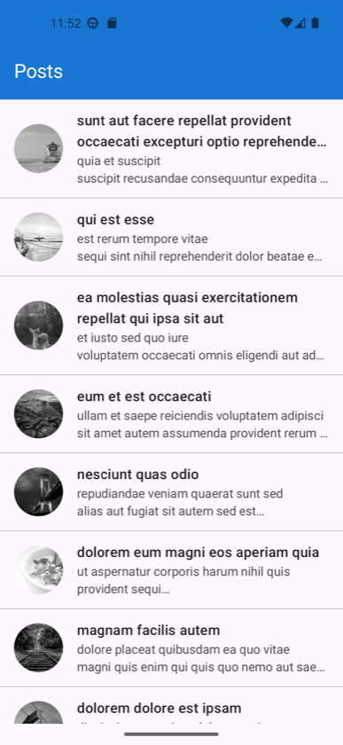

# Posts


An app that lists posts from `https://jsonplaceholder.typicode.com/posts`. You can swipe a post away
and undo it, and you can edit the title and body on a detail screen. Kotlin, XML views, Coroutines,
Hilt, Retrofit, DiffUtil.

There is also a Compose version of the same two screens. It runs on the same ViewModels. More on that
at the end.

| List | Detail | Swipe and undo |
|---|---|---|
|  |  |  |

| Dark mode | No network | Compose version |
|---|---|---|
|  |  |  |

## Running it

```bash
./gradlew assembleDebug
./gradlew testDebugUnitTest
./gradlew lintDebug
```

There is a minified APK on the [v1.0 release](https://github.com/erolgizlice/posts-android/releases/tag/v1.0).
I signed it with the debug key so you can install it right away. A real release would use its own
keystore.

The build runs on JDK 25, which `gradle/gradle-daemon-jvm.properties` asks for. The app targets
Java 17. These are two different things: the first is the JVM that runs Gradle, the second is the
bytecode that ships.

## Modules

```
        :app  (Activities, Hilt entry point)
         │
    ┌────┴─────┬───────────────┐
:ui:views   :ui:compose      :data
    └────┬─────┘               │
   :presentation ──────────────┤
         │                     │
      :domain  ◄───────────────┘
```

- `:domain` holds `Post` and `PostRepository`. It is a plain Kotlin module, so the Android SDK is not
  even on its classpath. It depends on nothing else in the project.
- `:data` has Retrofit, Moshi and the in-memory list. Every class in it is `internal`.
- `:presentation` has the ViewModels and the UI state. It knows the domain, not the data layer.
- `:ui:views` has the XML screens: RecyclerView, ItemTouchHelper, Fragments.
- `:ui:compose` has the Compose version of those screens.
- `:app` wires everything together.

I did not just write the rule down, I checked it. Two things that do not compile:

- `import android.os.Bundle` inside `:domain` gives `Unresolved reference 'android'`.
- Touching `:data`'s `PostDto` from `:ui:views` gives `Unresolved reference 'data'`.

## The repository

```kotlin
interface PostRepository {
    val posts: Flow<List<Post>>          // always sorted by Post.id
    suspend fun ensureLoaded()
    suspend fun update(post: Post)
    suspend fun delete(id: Int)
    suspend fun restore(post: Post)      // puts the post back in its place in the id order
}
```

Reading is a `Flow`, writing is a `suspend` function. A `Flow` is for data that keeps changing. A
`suspend` function is for one call that finishes. So there is no `getPosts()` returning a `Flow`
anywhere here.

Two details in this contract carry most of the features.

**The list is always sorted by id.** Undo does not have to remember where the post was. `restore`
puts it back where the order says it belongs. A test deletes a post, restores it, and checks that the
list is exactly what it was.

**The API is read once, and the name says so.** jsonplaceholder does not save writes. If I fetched
again, every local edit and deletion would quietly disappear. So it is `ensureLoaded`, not `refresh`.
If the fetch fails, nothing is marked as loaded, so retry works.

The detail screen reads the same list. When you save, the list updates by itself. No Fragment Result
API, no event bus.

## What I chose, and what I left out

| Choice | Why | Instead of |
|---|---|---|
| XML views as the main UI | The brief mentions `DiffUtils` and the adapter position, and the job posting asks for XML and Fragments | — |
| Coroutines and Flow | The state is easy to test without a scheduler | RxJava |
| Hilt | A missing binding breaks the build, not the app | Koin |
| Glide | Coil 3 needs a newer Kotlin stdlib than this compiler reads | Coil |
| Keeping the list in memory | The API does not save writes anyway. See the limitations below | Room |
| No use case layer | Each one would be a single line that forwards a call. The real rules live in the repository, where tests cover them | An interactor layer |
| Two Activities for the Compose version | `ComponentActivity` passes intent extras into `SavedStateHandle`, so the ViewModels stayed as they were | Navigation Compose |
| `Bundle` instead of `bundleOf` | `bundleOf` takes `Any?`, so a wrong type only shows up at runtime. It is deprecated for that reason | — |

## Three things I ran into

**The image URL is keyed by post id, not by position.** The brief suggests `?random=$itemPosition`.
I tried it: `random` is not a seed. The same value gives different images on different requests, so it
works as a cache buster. What keeps an image stable is the loader's cache, and that cache is keyed by
URL. If the URL depends on the position, every row under a deleted post gets a new URL and a new
picture. With `post.id` in the URL, each row keeps its image.

**A restored row can come back off screen.** RecyclerView and `LazyColumn` both keep the first visible
item where it is when the list changes. A post added above it lands outside the screen, so undo looks
like it did nothing. Both UIs scroll to the restored post, but only when it came back above the
viewport. If you can already see it, your scroll position is worth more.

**Compose remembers swipe state per item key.** `rememberSwipeToDismissBoxState` is saveable and
`LazyColumn` keeps saveable state per key. So a restored post came back still swiped away: the row sat
off screen and you only saw its red background. I keep that state out of the saved state now, with a
plain `remember`. A half finished swipe is not worth restoring.

## Tests

15 unit tests, all on the JVM.

- `PostRepositoryImplTest` (7): id ordering, delete and restore giving back the same list, one fetch
  only, retry after a failure, error translation, update in place, and two overlapping loads hitting
  the network once.
- `PostsViewModelTest` (4): loading to content, the error state, retry, delete and undo.
- `PostDetailViewModelTest` (3): reading the post from `SavedStateHandle`, trimming on save, and going
  null when the post is deleted.
- `PostMapperTest` (1): the DTO mapping.

I used fakes, not mocks. `FakePostApi` and `FakePostRepository` are small working implementations, so
a test reads like a scenario instead of a list of stubs. The fake API can also be made slow on purpose.
That is what the concurrency test needs: without a suspension point the two loads never overlap and
the `Mutex` is never really tested.

## Numbers

- The release APK is 2.9 MB with R8 on. The debug build is 23.7 MB.
- `hilt-navigation-compose` was pulling in Navigation Compose, which this project never uses. The
  navigation free artifact does the same job and took 257 KB off the debug APK.
- The build has no compiler warnings and lint reports no errors.

## What it does not do

- Deletions and edits are gone after a process restart. They live in memory. The API does not save
  writes either, so persistence would have to be local.
- After process death the post id survives, because it is in `SavedStateHandle`. The list does not.
- No pull to refresh. Fetching again would wipe local changes until the two are merged.

## What I would do next

- Keep deleted ids and edited posts locally and apply them on top of the fetched list. That merge is
  the first thing here that would deserve a use case.
- Pull to refresh, once that merge exists.
- Instrumented tests for swipe and undo.

## The Compose version

The XML app is the deliverable. The Compose module mirrors the same two screens to show that the
layering holds: both use the same `PostsViewModel` and `PostDetailViewModel`, so a post you edit in
Compose shows up edited in the XML list. Open it from the overflow menu on the list screen.

## Versions

AGP 9.4.0, Gradle 9.6.0, Kotlin 2.2.10 (the compiler that ships with AGP), KSP 2.3.12, Hilt 2.60.1,
Retrofit 3.0.0, Moshi 1.15.2, OkHttp 5.5.0, Glide 5.0.9, Compose BOM 2026.09.00. minSdk 24, compile
and target SDK 37, Java 17.
